<div align="center">


# GinkgoAdmin

**面向企业业务系统与长期二次开发的模块化业务底座**

基于 `.NET 8` + `Vue 3`，围绕 **DDD 分层**、**ALC 插件隔离** 与 **Contracts 契约边界** 构建的可持续演进底座。

[](https://dotnet.microsoft.com/download/dotnet/8.0)
[](https://vuejs.org/)
[](https://www.mysql.com/)
[](LICENSE)
[](LICENSE_COMMERCIAL)

[官方网站](http://www.ginkgoadmin.com) · [在线文档](http://www.ginkgoadmin.com/zh/web/docs-home) · [GitHub](https://github.com/GinkgoAdmin/GinkgoAdmin) · [Gitee 镜像](https://gitee.com/ginkgoadmin/Ginkgoadmin)

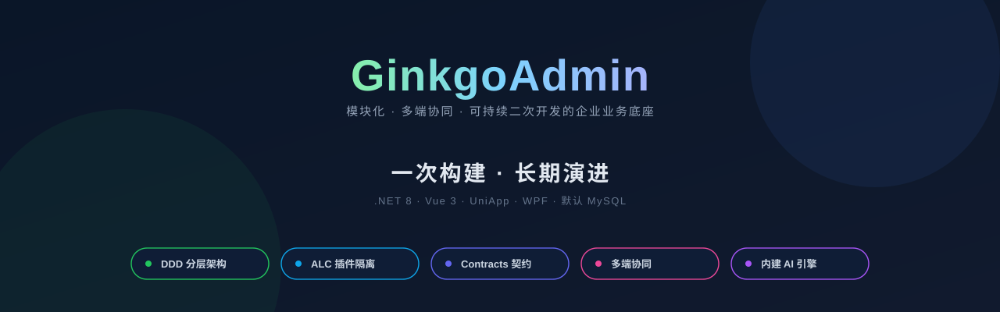

</div>

---

## 目录

- [一、它是什么](#一它是什么)
- [二、快速开始](#二快速开始)
- [三、整体架构](#三整体架构)
- [四、目录与功能截图](#四目录与功能截图)
- [五、适用场景](#五适用场景)
- [六、授权说明](#六授权说明)
- [七、文档与联系方式](#七文档与联系方式)

---

## 一、它是什么

GinkgoAdmin 是一套基于 `.NET 8` + `Vue 3` 的**模块化业务底座**：主框架以 **Apache 2.0** 开源，部分官方插件以商业形式提供，详见 [`LICENSE_COMMERCIAL`](LICENSE_COMMERCIAL)。

主框架直接提供：用户 / 角色 / 部门 / 菜单 / 字典 / 系统设置 / 文件存储 / 消息通知 / 实时通信 / 操作日志 / 审计 / 模块装载 / 插件宿主，并以同一套身份与权限链路同时承载 **Web 后台**（`/admin/*`）与 **Web 前台门户**（`/web/*`，前台首页位于 `web/src/views/web/index`）两端。

业务能力以**服务端模块（`src/Module/Ginkgo.Module.*`）+ Web 插件（`web/src/plugins/installed/*`）** 形式扩展，跨模块仅通过 `*.Contracts` 契约项目调用，互不硬引用。

---

## 二、快速开始

### 1) 环境要求


| 依赖                                                         | 版本                         |
| ------------------------------------------------------------ | ---------------------------- |
| [.NET SDK](https://dotnet.microsoft.com/download/dotnet/8.0) | 8.0 或更高                   |
| [Node.js](https://nodejs.org/)                               | 18 或更高                    |
| 数据库                                                       | **MySQL 5.7+ / 8.0**（默认） |
| 操作系统                                                     | Windows / Linux / macOS      |

### 2) 克隆代码

```bash
git clone https://github.com/GinkgoAdmin/GinkgoAdmin.git
cd GinkgoAdmin
```

> 当前仓库的 clone 地址会随发布镜像自动调整：在 GitHub 主仓上看到的是 `github.com/GinkgoAdmin/GinkgoAdmin`，在 Gitee 镜像仓上看到的是 `gitee.com/ginkgoadmin/Ginkgoadmin`，复制即可使用。

### 3) 启动后端并完成安装

```bash
dotnet run --project src/Server/Ginkgo.Api/Ginkgo.Api.csproj
```

默认监听 `http://localhost:5288`。首次启动未检测到 `resource/install.lock`，会进入安装模式，浏览器访问：

```text
http://localhost:5288/install
```

在向导中依次完成 **数据库连接（默认 MySQL）→ 管理员账号 → 站点信息**。安装完成后，安装器会写入 `resource/install.lock` 与 `resource/db.json`：

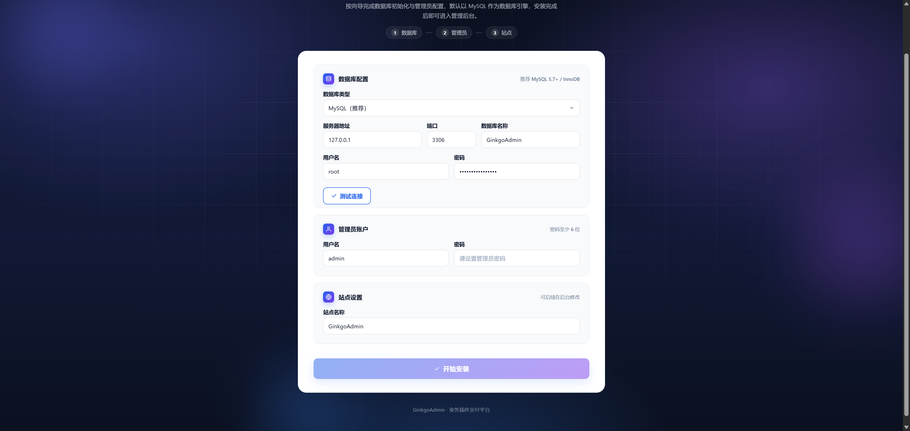

> ⚠️ **请重启后端服务**，让安装锁与数据库配置生效；重启后即进入正常运行模式。

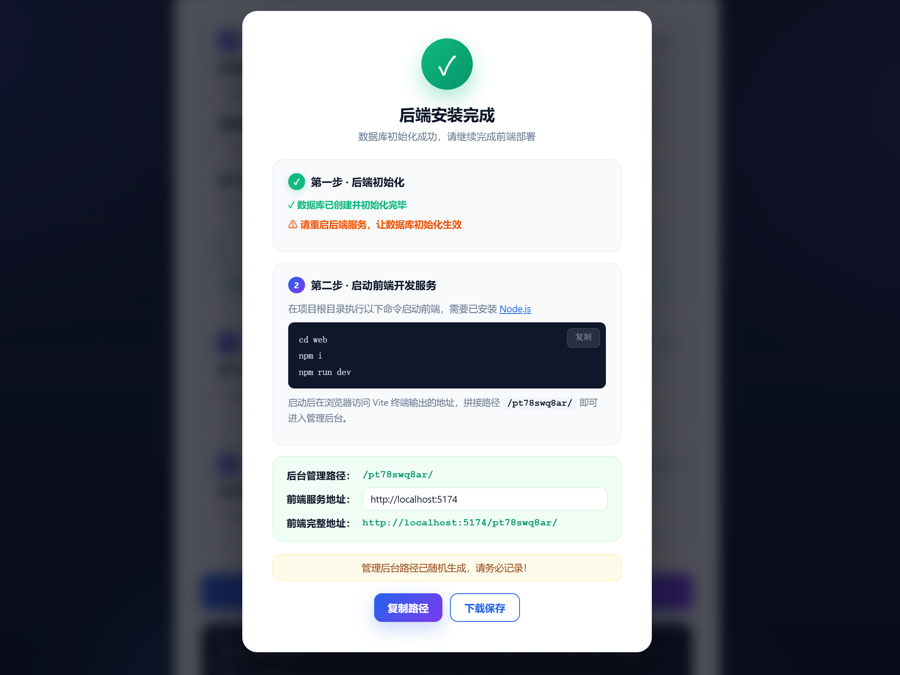

如需手动初始化，可参考 `resource/mysql_install.sql` 与 `resource/mysql_init_menus.sql`。

### 4) 启动 Web 前端

```bash
cd web
npm install
npm run dev
```

Vite 默认监听 `http://localhost:5174`，已内置 `/api` 反代。**安装向导会随机生成一段后台路径前缀**，请在安装完成页复制并保存，按 `http://localhost:5174/<后台地址>/` 进入后台(后台地址在web\src\config\admin.ts中修改ADMIN_SLUG)。前台门户访问 `http://localhost:5174/`。

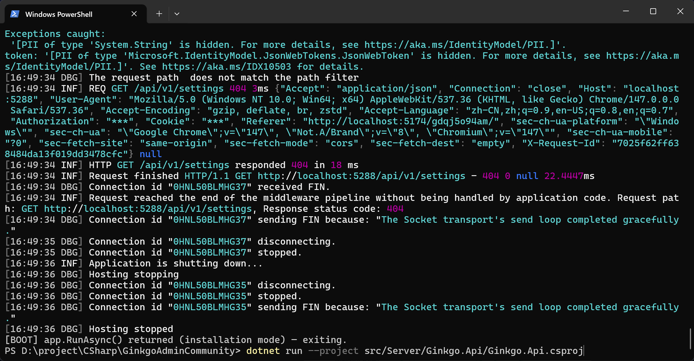

---

## 三、整体架构

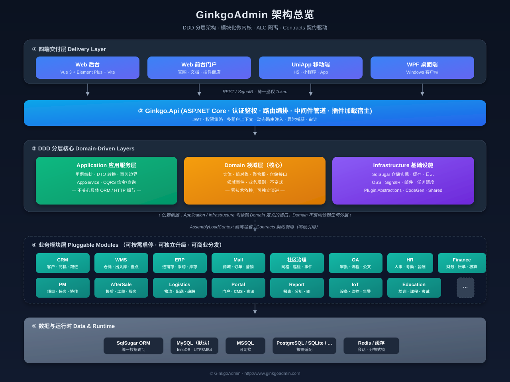

- **交付层**：Web 后台（`/admin/*`）与 Web 前台门户（`/web/*`）通过 REST + SignalR 接入服务端
- **宿主层**：`src/Server/Ginkgo.Api` 负责认证鉴权、路由编排、中间件管道与插件宿主
- **核心三层**：`Application / Domain / Infrastructure`，遵循依赖倒置，`Domain` 不反向依赖外层
- **模块层**：`src/Module/Ginkgo.Module.*` 以 ALC 隔离方式动态加载，跨模块仅通过 `*.Contracts` 契约调用
- **数据层**：SqlSugar 统一 ORM，默认 MySQL

---

## 四、目录与功能截图

### 目录结构

```text
GinkgoFramework-admin/
├── src/
│   ├── Server/                               # 服务端主框架
│   │   ├── Ginkgo.Api/                       # 启动入口与插件宿主（含 Bootstrap、Install、Modules）
│   │   ├── Ginkgo.Application/               # 应用服务层（用例编排、DTO）
│   │   ├── Ginkgo.Domain/                    # 领域层（实体、聚合、仓储接口）
│   │   ├── Ginkgo.Infrastructure/            # 基础设施(仓储实现、缓存、OSS 等）
│   │   ├── Ginkgo.Realtime/                  # 实时通信（SignalR）
│   │   ├── Ginkgo.Plugin.Abstractions/       # 插件抽象与生命周期接口
│   │   └── Ginkgo.Shared/                    # 跨层共享工具与常量
│   └── Module/                               # 业务模块目录（每个模块自带 contracts/server 等）
│       └── Ginkgo.Module.Xxx/
│           ├── contracts/                    # 跨模块契约（仅接口与 DTO，零依赖）
│           ├── server/                       # 模块后端实现
│           └── web/                          # 模块前端实现（如存在）
├── web/                                      # Web 前端工程（Vue 3 + Vite）
│   └── src/
│       ├── views/admin/                      # 后台系统页
│       ├── views/web/                        # 前台门户页（首页 index、登录、用户中心等）
│       └── plugins/installed/                # Web 插件目录
├── document/                                 # 主框架文档（架构、安装、模块、权限等）
├── resource/                                 # 安装脚本、菜单种子、上传目录
└── README.md / LICENSE / LICENSE_COMMERCIAL
```

### 功能截图

> 以下截图来自当前主框架仓库的实际运行界面，均为开箱即用、无需额外插件即可启用的内置能力。

**登录页**

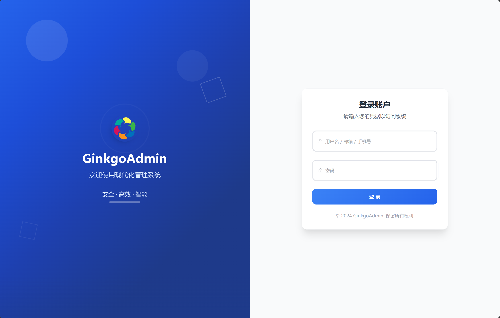

**用户注册**

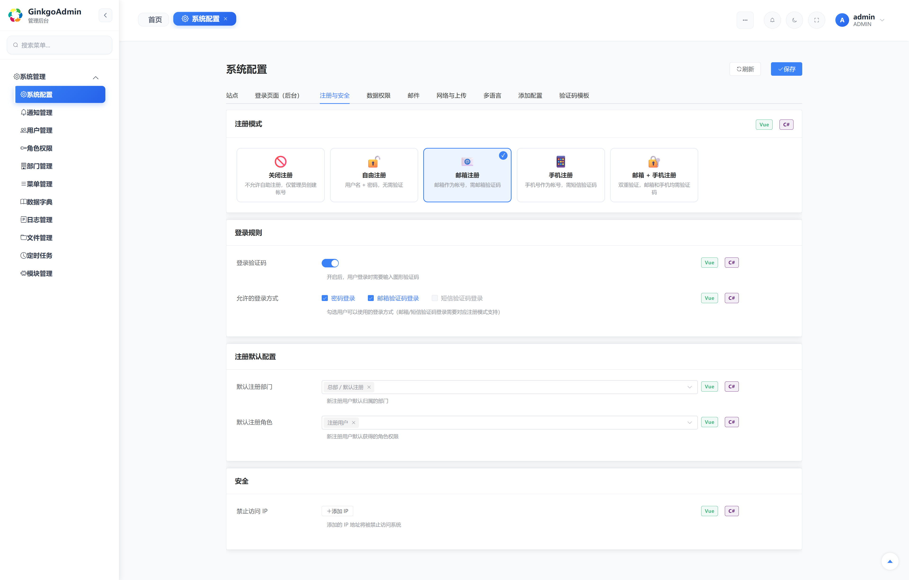

**菜单管理**

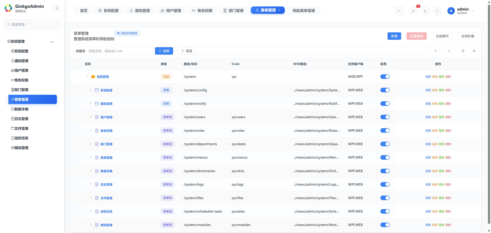

**角色与权限管理**

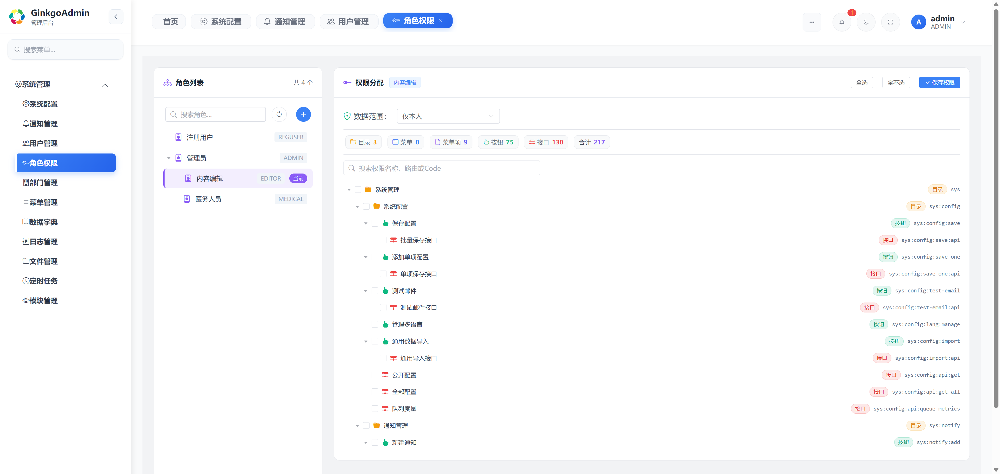

**系统配置**

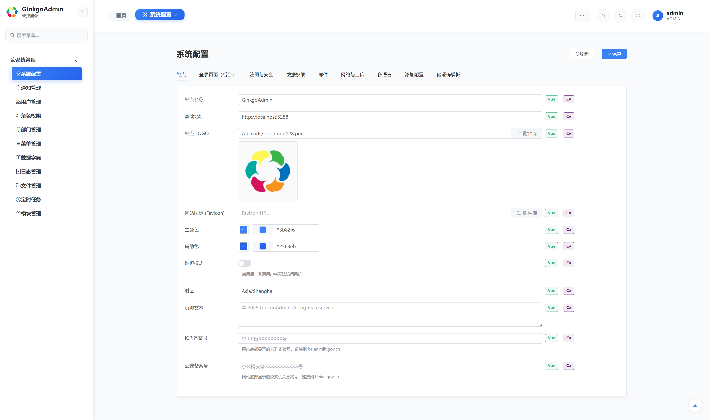

**数据字典**

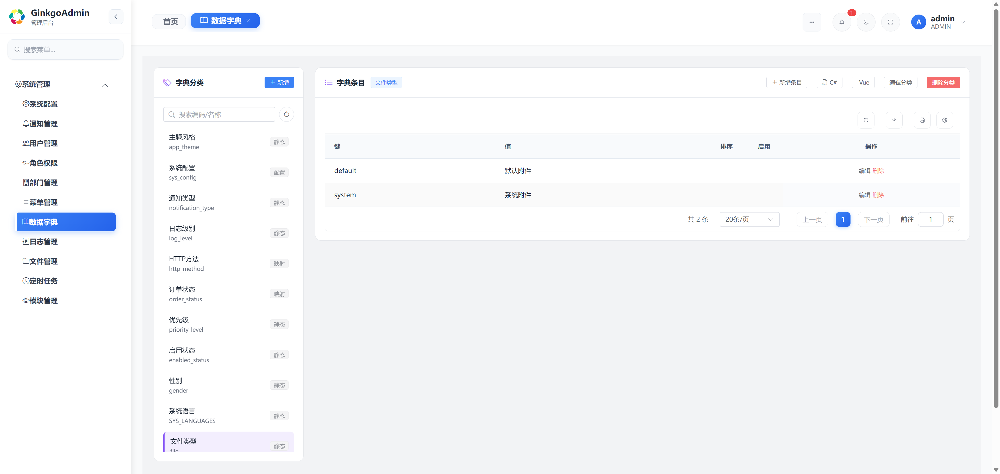

**日志审计**

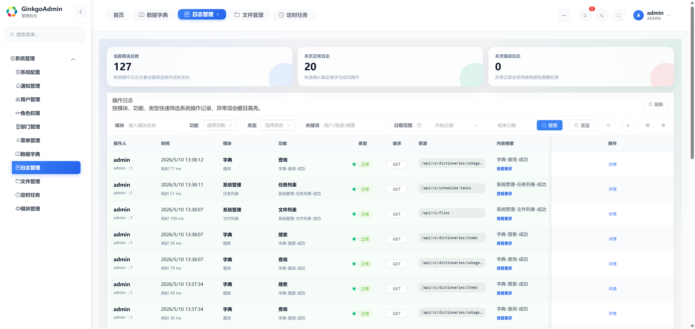

**定时任务**

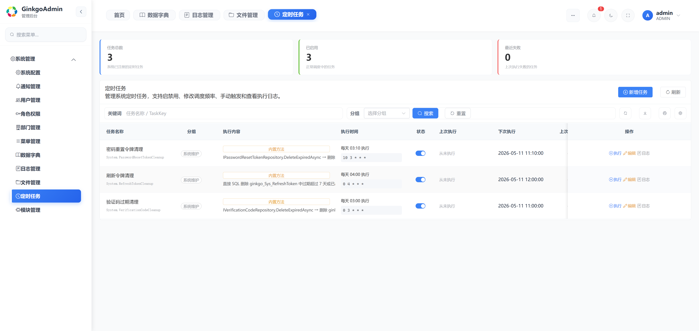

**附件管理**

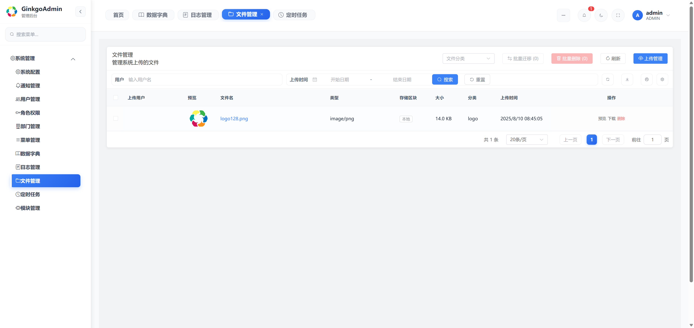

**即时通知（站内消息）**

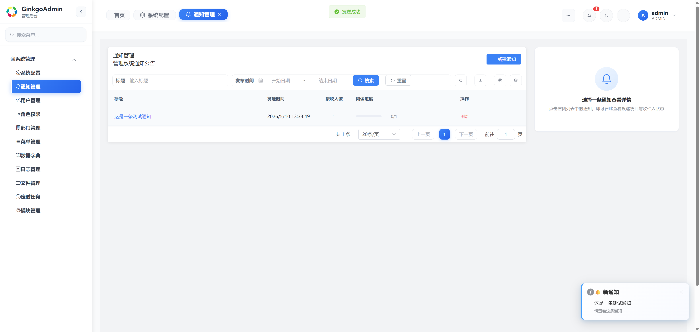

**远程插件商店**

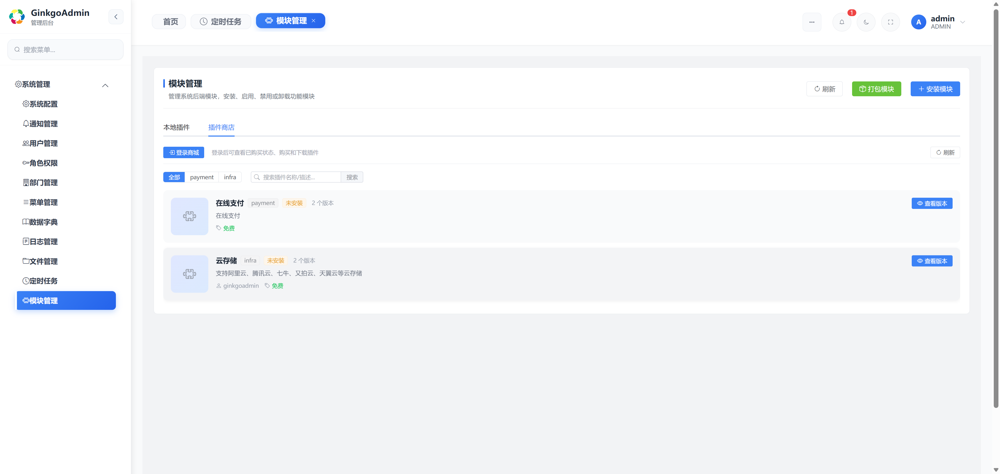

**模块配置示例（云存储 OSS）**

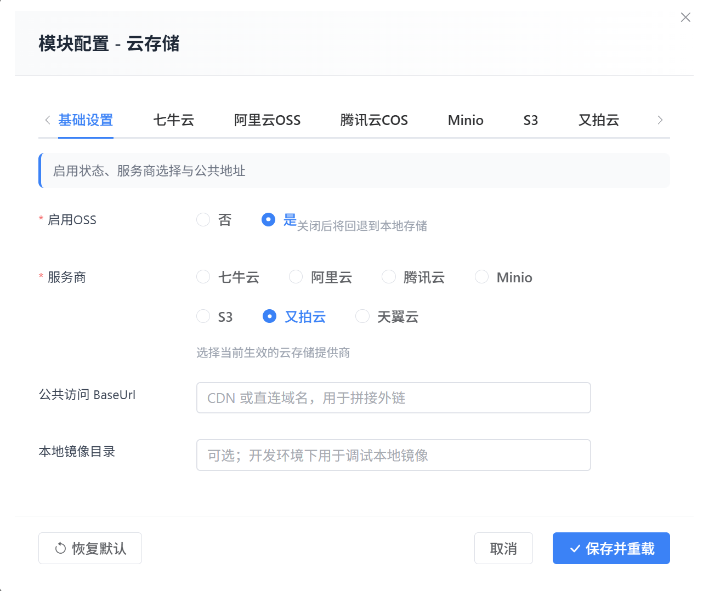

---

## 五、适用场景

- 中后台管理系统、行业业务平台、企业内部信息化系统
- 需要长期迭代、多期交付、持续沉淀业务资产的项目
- 希望以模块化方式沉淀行业方案或插件能力的研发团队
- 需要后台管理 + 前台门户共用一套底座的企业级 Web 应用

---

## 六、授权说明

GinkgoAdmin 采用 **主框架 Apache 2.0 + 商业权利物另行授权** 的模式：

- **主框架**：以 [Apache License 2.0](LICENSE) 开源；在遵守 Apache 2.0 的前提下，可自由用于多客户交付、外包项目、内部 SaaS、商业产品集成等商业场景
- **商业权利物**：部分官方插件、商业发行包、授权校验服务等以商业形式提供，使用前请阅读 [`LICENSE_COMMERCIAL`](LICENSE_COMMERCIAL) 并以订单/合同为准
- **商标**：项目名称、Logo、商标等权利**不随 Apache 2.0 一并授权**，详见 [`LICENSE`](LICENSE) 附加条款 A

商业授权咨询：**[http://www.ginkgoadmin.com](http://www.ginkgoadmin.com)**

---

## 七、文档与联系方式

推荐先读 `document/` 目录下的核心文档：

- [`主框架总览.md`](document/主框架总览.md)
- [`架构与运行机制.md`](document/架构与运行机制.md)
- [`安装与部署.md`](document/安装与部署.md)
- [`插件开发规范与流程.md`](document/插件开发规范与流程.md)
- [`认证与登录.md`](document/认证与登录.md)
- [`权限管理.md`](document/权限管理.md)
- [`AGENTS.md`](AGENTS.md) —— AI 编程助手与人工开发者共同遵循的开发红线

完整文档索引见 [`document/文档总索引.md`](document/文档总索引.md)，更多内容请访问 **[在线文档中心](http://www.ginkgoadmin.com/zh/web/docs-home)**。


| 渠道       | 地址                                                                                     |
| ---------- | ---------------------------------------------------------------------------------------- |
| 官方网站   | [http://www.ginkgoadmin.com](http://www.ginkgoadmin.com)                                 |
| GitHub     | [https://github.com/GinkgoAdmin/GinkgoAdmin](https://github.com/GinkgoAdmin/GinkgoAdmin) |
| Gitee 镜像 | [https://gitee.com/ginkgoadmin/Ginkgoadmin](https://gitee.com/ginkgoadmin/Ginkgoadmin)   |
| 问题反馈   | [GitHub Issues](https://github.com/GinkgoAdmin/GinkgoAdmin/issues)                       |

---

<div align="center">

**如果 GinkgoAdmin 对你有帮助，欢迎点亮 ⭐ Star 支持我们！**

© GinkgoAdmin Project Authors. Licensed under Apache 2.0.

</div>
