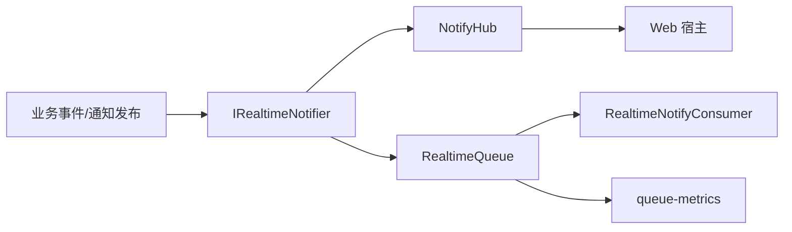

# 实时通信

## 1. 功能定位
实时通信负责承接系统通知、消息投递、在线消息刷新和队列指标监控，是消息中心、通知管理等能力的基础设施。

## 2. 核心能力
- 服务端通过 `Ginkgo.Realtime` 注册 SignalR Hub、实时通知器和队列实现。
- 当前仓库内含 `NotifyHub`、`IRealtimeNotifier`、`RealtimeNotifier`、`RealtimeQueue` 与 Rabbit 扩展实现。
- 系统级队列指标通过 `SystemController` 的 `queue-metrics` 接口提供。
- 通知管理与消息中心可在实时链路和普通 API 查询之间互相补位。

## 3. 使用场景
- 后台发布通知后，希望用户端更快感知未读变化。
- 运维人员需要查看当前实时队列指标或消息消费状态。
- 模块或插件需要通过统一接口触发实时消息，而不是直接依赖具体 Hub。

## 4. 使用方法

- 服务端启动时由 `AddRealtimeServices` 注册实时通信相关服务。
- 需要即时通知时优先依赖 `IRealtimeNotifier`，不要在业务里直接绑定 Hub 细节。
- 需要监控时调用 `/api/system/queue-metrics` 查看当前指标。

## 5. 快速调用
- 指标接口：`GET /api/system/queue-metrics`
- 通知接口：见 [通知管理](./通知管理.md)
- 消息接口：见 [消息中心](./消息中心.md)

## 6. 二次开发
- 新增实时消息能力时，优先扩展 `Ginkgo.Realtime` 提供的通知器与队列抽象。
- 不建议在普通业务控制器里直接写长连接逻辑，应统一挂到实时通信基础设施上。

## 7. 关键入口
- 服务端：`src/Server/Ginkgo.Realtime/IRealtimeNotifier.cs`
- Hub：`src/Server/Ginkgo.Realtime/NotifyHub.cs`
- 队列：`src/Server/Ginkgo.Realtime/RealtimeQueue.cs`、`RealtimeQueue.Rabbit.cs`
- 装配：`src/Server/Ginkgo.Api/Bootstrap/RealtimeSetup.cs`
- 指标：`src/Server/Ginkgo.Api/Controllers/SystemController.cs`

## 8. 注意事项
- 实时链路应作为"加速反馈"使用，通知与消息的最终状态仍应以服务端数据为准。
- 需要跨模块发送消息时，应优先使用统一抽象而不是各自维护私有长连接。

## 9. 常见问题
- 发布后 Web 端无提示：先检查 SignalR 连接是否建立成功。
- 消息数量变化不及时：先看是否只写了数据库记录但没有走实时通知器。
- 队列指标异常：优先调用 `queue-metrics`，再检查 `Ginkgo.Realtime` 的后端实现与配置。
