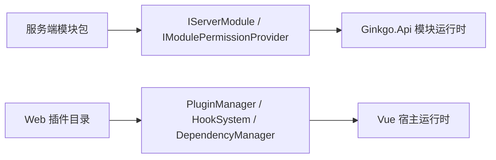

# 插件注入与加载机制

## 1. 功能定位
插件注入与加载机制用于解释主框架如何在服务端与 Web 宿主两个层面接受扩展能力，并把扩展点接入到当前运行时。

## 2. 核心能力
- 服务端模块通过 `IServerModule` 注入服务与生命周期回调。
- 服务端模块权限可通过 `IModulePermissionProvider` 向系统声明资源和显示名。
- Web 插件通过 `web/src/plugins/core` 提供的 `PluginManager`、`HookSystem`、`DependencyManager` 完成依赖加载、钩子注册和组件注册。
- 这些扩展点共同构成"主框架稳定、扩展按宿主注入"的模型。

## 3. 使用场景
- 业务模块需要向服务端注册应用服务、定时任务或权限资源。
- Web 宿主需要挂入新的页面、组件、钩子或外部前端依赖。
- 需要在宿主层扩展公共行为而不修改主框架核心。

## 4. 使用方法

- 服务端模块在运行时通过 `ModuleLoader` 查找并实例化 `IServerModule`。
- Web 插件注册时先检查依赖，再按需加载 npm/CDN 依赖和静态资源，最后执行 `install(api)`。

### 4.1 Web 插件装载流程（三轨）
为兼顾首屏速度与全局钩子可用性，Web 端 `PluginManager.initialize()` 同时支持三种装载模式，由 `router/index.ts` 的 `beforeEach` 协同触发：
1. **按路径懒加载** —— 根据当前路由段调用 `initPluginRoutes` / `initPortalPluginRoutes`，仅装载与路径段匹配的业务插件；命中不到具体插件时回退一次全量加载，保证旧插件兼容。
2. **始终加载（横切关注点）** —— 入口先调用 `ensureCorePluginsLoaded()`，以 `coreOnly: true` 装载所有在自身 `module.json` 中声明 `"loadPolicy": "always"` 的插件。`PluginManager` 启动时通过 `import.meta.glob('../installed/*/module.json', { eager: true, import: 'default' })` 同步扫描汇总，运行时不在代码中硬编码任何具体插件名。
3. **门户共享容器兜底** —— 进入带 `meta.portalShellNeedsPlugins: true` 的静态注册路由（典型如会员中心 `/web/user*`）时调用 `ensurePortalPluginsLoaded()`，按 portal 全量装载一次门户业务插件，使 `portal:user-menu` 等"门户共享插槽"钩子能在静态命中页面渲染前已注册。短路标记 `portalFullPluginsLoaded` 保证全应用首次进入会员中心后不再重复装载。

判定一个新增 Web 插件应该走哪条轨道、`module.json` 该如何写、何时给静态路由加 `portalShellNeedsPlugins`，统一参照 [插件开发规范与流程](./插件开发规范与流程.md) 第 9 节《Web 插件加载策略（必读）》。

`PluginManager` 的"后端启用过滤"同时支持两种匹配口径：
- 旧规则：把后端模块 ID 拆 `Ginkgo.Module.` 前缀并连字符化、小写，与前端目录名比对（适用于命名一致的插件）。
- 精准匹配：扫描各前端 `module.json` 中声明的 `moduleId`，与后端启用列表忽略大小写比对（用于目录名与后端模块名不一致的场景）。

两条匹配口径同时生效，新增插件无需关心后端模块名命名风格。

## 5. 快速调用
- 服务端模块抽象：`src/Server/Ginkgo.Plugin.Abstractions/IServerModule.cs`
- Web 插件入口：`web/src/plugins/core/PluginManager.ts`
- Web 插件类型：`web/src/plugins/core/types.ts`

## 6. 二次开发
- 服务端扩展优先通过契约接口、模块加载器和模块权限提供器接入。
- Web 扩展优先通过插件目录和钩子系统接入，不要在主框架全局直接硬编码业务组件。

## 7. 关键入口
- 服务端抽象：`src/Server/Ginkgo.Plugin.Abstractions`
- Web 宿主：`web/src/plugins/core`
- Web 启动入口：`web/src/plugins/index.ts`

## 8. 注意事项
- Web 插件与服务端模块是两层不同概念，前者偏前端宿主能力，后者偏服务端运行时能力，文档与实现都不应混用。
- Web 插件依赖管理支持 npm/CDN 两种来源，但生产环境更应优先控制版本和来源安全。

## 9. 常见问题
- 服务端模块已安装但能力未生效：先检查是否实现了 `IServerModule`，再看是否成功进入运行时。
- Web 插件注册失败：优先检查依赖、资产加载和 `install(api)` 执行错误。
