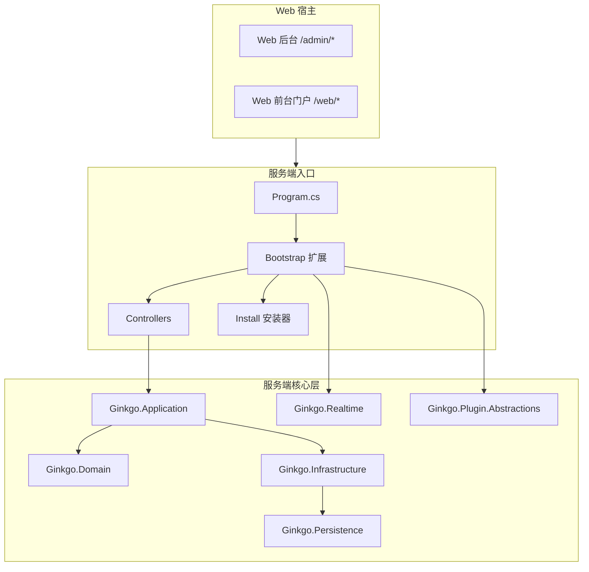

# 架构与运行机制

## 1. 概述
本篇从启动装配、分层结构、请求管道、模块预加载、静态资源托管和后台/前台门户协作六个方面说明开源版主框架的真实运行方式，适合作为定位问题和理解整体底座的入口文档。

## 2. 背景与目标
- 让 `Program.cs` 保持编排入口角色，把复杂装配拆入 `Bootstrap` 目录。
- 让服务端分层、实时通信、模块运行时和 Web 宿主职责明确，便于长期扩展。
- 让 Web 后台与 Web 前台门户围绕同一服务端底座协同运行。

## 3. 总体架构

## 4. 运行机制
- `Program.cs` 先完成配置加载、Snowflake 初始化、数据库注册、实时通信注册、JWT 注册和应用服务注册。
- `Bootstrap/ServiceRegistration.cs` 负责控制器、Swagger、限流、压缩、CORS、API 版本等服务装配。
- `Bootstrap/MiddlewarePipeline.cs`、`EndpointMapping.cs`、`StaticFiles.cs` 负责请求管道、控制器端点、Hub、SPA 回退与静态资源映射。
- `Bootstrap/ModulePreloader.cs` 与 `ModuleRuntimeBootstrap.cs` 负责模块预扫描、运行时注册和后置加载。
- 正常请求会经过日志、异常处理、鉴权、控制器执行；安装模式请求则走最小化安装管道。

## 5. 安装与部署
- 主框架既支持开发态源码运行，也支持生产态服务端托管前端构建产物。
- Web 后台与前台门户最终都可由服务端静态资源托管，使用同一个域名/端口下的不同路径。

## 6. 使用方式
- 查启动问题时优先看 `Program.cs` 和 `Bootstrap` 目录。
- 查业务 API 时优先从 `Controllers` 入手，再顺着 `Application`、`Infrastructure` 和 `Persistence` 往下追。
- 查 Web 宿主问题时优先看 `web/src/api`、`web/src/stores`、`web/src/plugins/core` 与对应视图目录。

## 7. 二开入口
- 启动装配：`src/Server/Ginkgo.Api/Program.cs`
- 服务装配：`src/Server/Ginkgo.Api/Bootstrap/*.cs`
- 服务端核心：`src/Server/Ginkgo.Application`、`src/Server/Ginkgo.Domain`、`src/Server/Ginkgo.Infrastructure`
- 模块运行时：`src/Server/Ginkgo.Api/Modules/*.cs`
- Web 插件宿主：`web/src/plugins/core/*.ts`

## 8. 注意事项
- 当前仓库是「主框架 + 业务模块/插件共存」形态，理解架构时要先分清主框架与业务扩展的边界。
- 系统级页面入口主要集中在 `web/src/views/admin/system`（后台）与 `web/src/views/web`（前台门户）。
- 机制文档中的代码入口比旧版说明更可信，应优先以当前目录结构和控制器实现为准。
