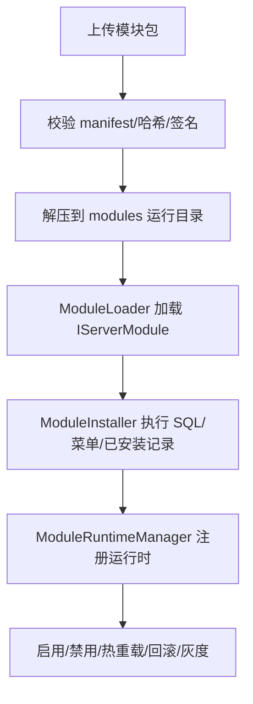

# 模块加载与热插拔

## 1. 功能定位
模块加载与热插拔负责把服务端模块包导入当前系统，完成安装、启停、热重载、回滚、灰度、依赖检查、菜单重置和前后端资源协同，是主框架最重要的扩展运行时能力。

## 2. 核心能力
- `ModulesController` 提供安装、升级、卸载、启用、禁用、热启用、热禁用、热重载、上传安装、打包、灰度、回滚和安全状态查询接口。
- `ModuleLoader` 负责把包解压到运行目录，并通过独立加载上下文（ALC）查找 `IServerModule`。
- `ModuleInstaller` 负责依赖检查、安装 SQL、菜单应用、已安装记录维护、热卸载与待删除目录处理。
- `ModulePackageService` 负责打包源码或编译产物，支持导出真实数据库结构与部分数据。
- 运行时还包含安全审计、签名校验、哈希校验、快照与灰度发布支持。

## 3. 使用场景
- 在开发环境安装新的模块包并同步启用。
- 对已安装模块做热重载、热卸载或回滚到历史快照。
- 对模块执行安装 SQL、重置菜单或灰度发布。
- 在问题定位时查看模块状态、状态日志和待删除目录。

## 4. 使用方法

- 管理后台使用 `ModuleManager.vue` 作为统一入口。
- 上传模块可先做验证，再确认安装，也可一步完成上传安装。
- 热重载与热卸载会处理运行时注册、Web 文件、NuGet 依赖和待删除目录。
- 开发环境还支持模块打包与模块源目录管理。

## 5. 快速调用
- 查看已安装模块：`GET /api/v1/modules/installed`
- 查看模块状态：`GET /api/v1/modules/status`
- 启用/禁用模块：`POST /api/v1/modules/enable`、`/disable`
- 热重载模块：`POST /api/v1/modules/hot/reload`
- 上传安装模块：`POST /api/v1/modules/upload-install`
- 打包模块：`POST /api/v1/modules/package`

## 6. 二次开发
- 新模块应实现 `IServerModule`，必要时补 `IModulePermissionProvider`。
- 模块的安装脚本、菜单和运行时资源应通过标准包结构交付，不应直接改主框架代码。
- 打包、安装和热卸载行为如果需要扩展，应优先落在 `Modules` 目录的运行时服务中。

## 7. 关键入口
- 控制器：`src/Server/Ginkgo.Api/Controllers/ModulesController.cs`
- 运行时：`src/Server/Ginkgo.Api/Modules/ModuleLoader.cs`
- 安装器：`src/Server/Ginkgo.Api/Modules/ModuleInstaller.cs`
- 打包：`src/Server/Ginkgo.Api/Modules/ModulePackageService.cs`
- 模型：`src/Server/Ginkgo.Api/Modules/ModuleModels.cs`
- Web 页：`web/src/views/admin/system/ModuleManager.vue`

## 8. 注意事项
- 安装、回滚和卸载都可能触发表数据、菜单数据和文件目录变化，必须优先在开发环境验证。
- 模块边界应保持在 `src/Module` 和打包目录内，不要为模块需求修改主框架核心层。

## 9. 常见问题
- 模块上传成功但安装失败：通常是入口程序集、依赖检查、SQL 执行或权限菜单声明存在问题。
- 热卸载后目录未删除：查看待删除目录接口，通常是 DLL 句柄仍被占用。
- 状态异常但页面未报错：优先检查模块状态接口、状态日志。
