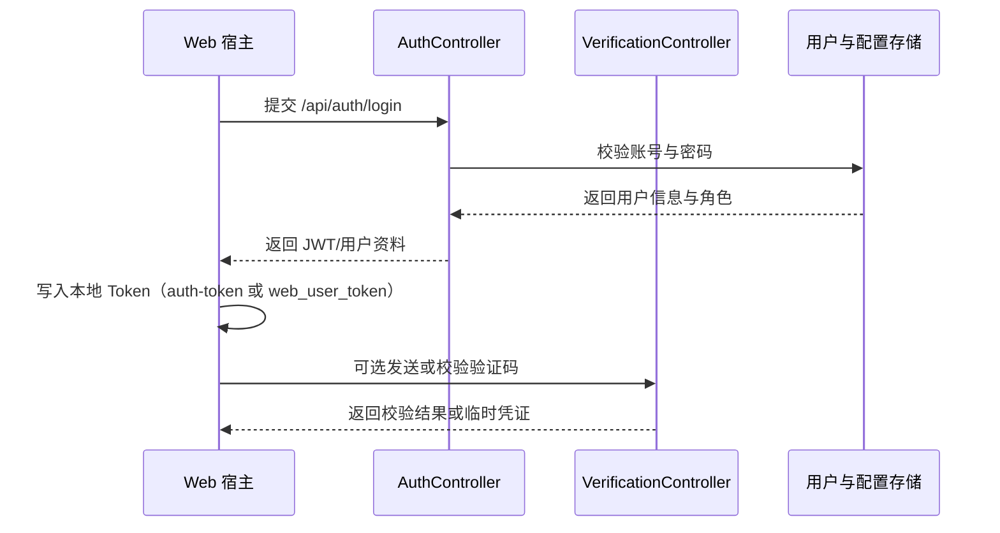

# 认证与登录

## 1. 功能定位
认证与登录负责统一管理后台用户与门户用户的登录、退出、令牌刷新、注册、找回密码和验证码链路，是 Web 后台与 Web 前台门户接入主框架的第一入口。

## 2. 核心能力
- 基于 `AuthController` 提供登录、退出、刷新、撤销、注册、找回密码和重置密码接口。
- 基于 `VerificationController` 提供验证码发送、校验、渠道查询和模板管理接口。
- Web 宿主通过 `web/src/api/http.ts` 自动按路径切换后台 `auth-token` 与门户 `web_user_token`，**双令牌**互不干扰。
- 后台管理端登录页位于 `/admin/login`，门户登录页位于 `/web/login`。

## 3. 使用场景
- 管理后台使用账号密码登录系统。
- 门户用户访问 `/web/*` 页面时使用门户令牌链路。
- 找回密码、校验联系方式和验证码校验场景统一走服务端认证体系。

## 4. 使用方法

- Web 后台登录主要通过 `web/src/api/auth.ts` 调用 `/auth/login`。
- 门户登录使用同一组 `/auth/*` 接口，但 `clientType` 不同，令牌写入 `web_user_token`。
- 退出登录统一调用 `/auth/logout`，并清除本地令牌。
- 当前用户信息、修改本人资料和修改本人密码主要走 `/api/v1/users/me` 相关接口。

## 5. 快速调用
- Web 后台：调用 `login(userName, password, 'WEB_ADMIN')`。
- Web 门户：依然使用统一 `http.ts`，但令牌会写入 `web_user_token`。
- 验证码：通过 `web/src/api/auth.ts` 的验证码相关方法发送/校验。

## 6. 二次开发
- 新增登录端时，应优先复用现有 `/api/auth/*` 接口，不要另造登录、刷新和失效处理链路。
- 需要新增认证因素时，应优先扩展验证码、联系方式校验和模板能力。
- 若要区分客户端类型，应沿用 `clientType` 参数和现有令牌存储约定。

## 7. 关键入口
- 服务端：`src/Server/Ginkgo.Api/Controllers/AuthController.cs`
- 验证码：`src/Server/Ginkgo.Api/Controllers/VerificationController.cs`
- Web 后台 API：`web/src/api/auth.ts`、统一 HTTP：`web/src/api/http.ts`
- Web 后台 Store：`web/src/stores/auth.ts`
- Web 门户 Store：`web/src/stores/webAuth.ts`
- Web 后台登录页：`web/src/views/admin/login`
- Web 门户登录页：`web/src/views/web/login`

## 8. 注意事项
- Web `http.ts` 已内置 `/api` 前缀和后台/门户令牌切换，不要重复拼接 `/api` 或手写 `Authorization`。
- 后端的认证接口不全部使用版本化路由，`/api/auth/*` 与 `/api/auth/verification/*` 都是当前真实入口。
- Web 后台/门户登录页（`/admin/login`、`/web/login`）是静态注册路由，插件懒加载体系下默认不会触发 `initPluginRoutes` / `initPortalPluginRoutes`。任何需要在登录页/449 验证码挑战/OAuth 回调时生效的插件钩子（典型：`http:biz-error` 449 拦截、`slot:login-actions`/`slot:admin-login-actions` 登录页插槽、`portal:standalone-route` 顶层独立路由、`auth:login`/`auth:logout` 全局钩子），必须由插件方在自身 `module.json` 中声明 `"loadPolicy": "always"`，详见 [插件开发规范与流程](./插件开发规范与流程.md) 第 9 节。

## 9. 常见问题
- 登录成功但接口仍返回 401：先检查宿主是否把令牌写到了正确的存储键（后台 `auth-token`、门户 `web_user_token`）。
- 门户端串用了后台令牌：检查访问路径是否在 `/web` 下，以及 `http.ts` 是否按门户路径分流。
- 找回密码流程无效：先确认联系方式存在，再确认验证码渠道和模板是否启用。
